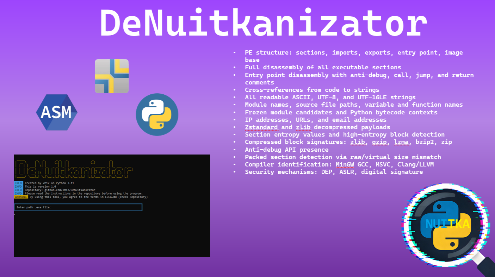
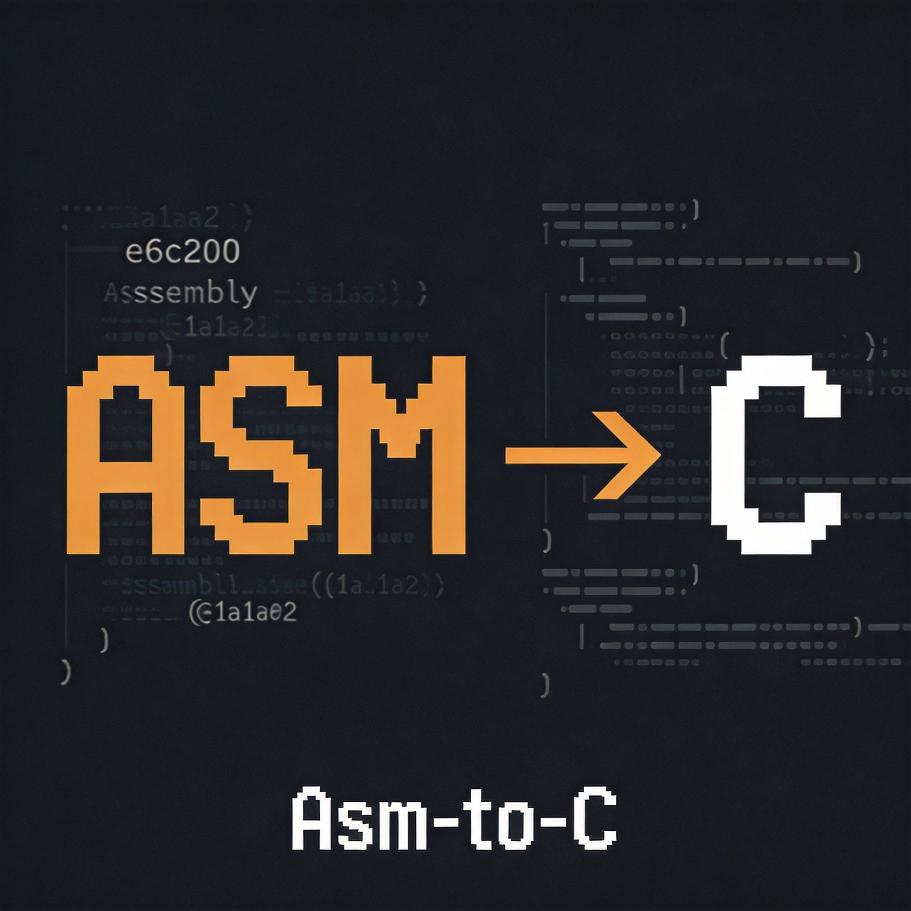
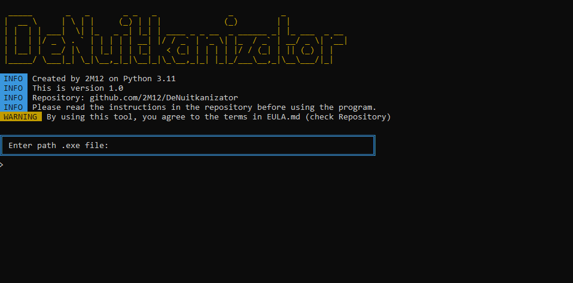

<div align="center">
  <p align="center">
    
  </p>

  <br>
  <h1>🔬 DeNuitkanizator</h1>
  <h4>A utility for analyzing .exe files compiled with Nuitka (as well as PyInstaller and other packers), and other non‑Python .exe files. Extracts metadata, strings, modules, PE structure info, and other useful data.</h4>

  
  
  
  
  


  <p align="center">
    
  </p>
</div>

<br>

---
>[!WARNING] 
>
> ## 🇷🇺 Not for an English audience
> If you are an Russian audience, then read [README.md](https://github.com/2M12/DeNuitkanizator/blob/main/README.md)

## ❓ Why you need this

**Nuitka** compiles Python into machine code. Your `.py` becomes a native `.exe`, and you can’t inspect it with standard tools. PyInstaller files can still be unpacked, but Nuitka files cannot.

**DeNuitkanizator** solves this problem. It:
- Shows what the file was built with
- Extracts everything possible: strings, modules, paths, IP addresses, URLs
- Fully disassembles the machine code
- Finds connections between code and strings
- Detects suspicious patterns

**Who it’s for:** reverse engineers, malware analysts, Python developers, security researchers.

> **Important:** this is not a decompiler. Nuitka compiles Python to C and then to machine code — fully restoring the original code is practically **impossible**.

---

> [!WARNING]
> ## Before using the program, please read the [EULA.md — End User License Agreement](https://github.com/2M12/DeNuitkanizator/blob/main/EULA-en.md)

---

> [!CAUTION]
> ### ❗ About fake copies
> Official sources are only those that are in the profile [2M12](https://github.com/2M12/2M12/blob/main/README.md ). I do not post anything on Telegram channels/groups or other sources (they are not official). If you come across something outside of this repository, these are false copies that often contain malware.

>[!NOTE]
> ### ❗ Important notes
> * Analysis results are **not guaranteed** - they depend on the Nuitka version, compilation settings, and LTO usage.
> * The tool is provided **as is**.
> * **Primary focus is Nuitka**, but the analyzer also works with PyInstaller, cx_Freeze, and other packers.
> * The program can analyze regular .exe files not written in Python.
> * PyInstaller provides more detailed info because it’s simpler and stores more metadata inside the .exe.
> * The program supports analyzing native .exe files and other packers.

## 🔍 Features

### 🕵️ Detection
* Identifies builds via **Nuitka** (using 8 signatures and `.rsrc` entropy).
* Distinguishes Nuitka from PyInstaller and cx_Freeze (marks as Unknown for other packers).
* Detects **Python version** (3.7–3.11) via magic numbers.

### 📥 Data extraction
* **Strings**: ASCII (4+/8+ characters), UTF‑16LE, UTF‑8.
* **Modules**: names of imported and frozen Python modules.
* **Source paths**: debug paths from `.rdata`/`.data`.
* **Variable and function names**: identifiers from data sections.
* **Network data**: IP addresses, URLs, email addresses.

### 🧩 PE structure analysis
* **Sections**: names, sizes, entropy, access rights, executable flag (EXEC).
* **Imports**: all DLLs and functions (including Python C API).
* **Exports**: exported functions.
* **Hashes**: MD5, SHA1, SHA256 of the file.
* **Compiler**: detection (MinGW GCC, MSVC, Clang/LLVM).
* **Protection mechanisms**: DEP, ASLR.

### 🗜️ Unpacking
* **Zstandard (zstd)**: main compression algorithm for Nuitka OneFile.
* **Zlib**: search and unpack alternative compressed blocks.
* Search for compressed blocks by signature: zlib, gzip, lzma, bzip2, zip.

### 💻 Disassembly (if Capstone is available)
* **Full disassembly** of all executable sections (`Disasm/full/`).
* **Entry Point**: with comments `[CALL]`, `[JMP]`, `[RET]`, `[ANTI-DEBUG]`.
* **Auto‑architecture detection**: x86 or x64 from the PE header.
* **String cross‑references** (`string_xrefs.txt`): which code references which strings.
* **Asm-to-C** technology translation: now (`.text_full.asm`) is fully translated into readable C code. Inspired by the line-by-line translation tool [cisol](https://github.com/rdbv/cisol)
* **The basis of Asm-to-C** technology: Registers, stack (`push`/`pop`), flags (`ZF`, `CF`, `OF`, `SF`, `PF`, `AF`) are emulated. Function calls are also emulated via `goto` tags.

>[!NOTE]
> ### 🔄 Asm-To-C
> **Asm-To-C** technology for translating assembly code (x86/x64) into readable C code. It is based on line-by-line conversion of instructions: each assembler instruction is translated into an equivalent C macro that emulates the operation of registers, stack, flags (ZF, CF, OF, SF, PF, AF) and memory.
>
>Function calls are emulated via goto tags, push/pop via stack macros. The technology is inspired by the [cisol](https://github.com/rdbv/cisol) and adapted for integration into DeNuitkanizator.
>**Output format:** readable C code with comments that preserve the original assembly instructions. It is intended for analyzing and understanding the logic of binary code, not for compilation.
><p align="center">
>  
></p>

### ⚠️ Suspicious element detection
* **Anti‑debug API**: `IsDebuggerPresent`, `CheckRemoteDebuggerPresent`, etc.
* **Anti‑debug code patterns**: `rdtsc`, `int 3`, `mov eax, fs:[30h]`.
* **Packed sections**: abnormal raw/virtual size ratio.
* **High entropy**: sections with high entropy (possible encryption).

### 🔄 Auto‑update
* Checks for new versions via GitHub API on launch.
* Status indicator: Latest / Update Available / Offline.

## 🖼️ Screenshots

<p align="center">
  
  <br><em>Main menu — entering the path to the .exe</em>
</p>

<p align="center">
  
  <br><em>Real‑time analysis process</em>
</p>

<p align="center">
  
  <br><em>Final report in summary.txt</em>
</p>

---

>[!WARNING]
> ### ⚠️ Limitations
> * **Does not restore original Python code.**
> * **Does not decompile machine code back to Python.**
> * **Does not guarantee 100% extraction of all data.**
> * May miss some info with aggressive **LTO optimization**.

---

## 📥 Installation

### Method 1: Pre‑built .exe
Download `DeNuitkanizator.exe` from [Releases](https://github.com/2M12/DeNuitkanizator/releases) and run it.

### Method 2: From source
```bash
git clone https://github.com/2M12/DeNuitkanizator.git
cd DeNuitkanizator
pip install -r requirements.txt
python DeNuitkanizator.py
```                                                       
---

## 🛠 Usage instructions
1. Launch `DeNuitkanizator.exe`, or if you downloaded the Python file, `DeNuitkanizator.py`.
2. Enter the path to the .exe file, or run: `python DeNuitkanizator.py "path"`.
3. The file analysis will start, and results will appear in the `DeNuitkanizator_Output` folder.
4. You can then review the files. `summary.txt` contains a summary only.

## Example of use
<p align="center">
  
</p>

---

## 🔵 Requirements
* Administrator rights (required for certain analysis operations)
* If using the `.py` script — install required libraries via `pip install -r requirements.txt`

## ☑️ Hash sums
```bash
MD5	38250e8de81422d26b881ee3843942a5
SHA-256	a0a7240805dd8dfca9508be8c4d4e7ff25a06496868ba37ac16a8f43be7f6633
```
## 📜 License
MIT © 2026 Mikhail (2M12) / ThreatBit
