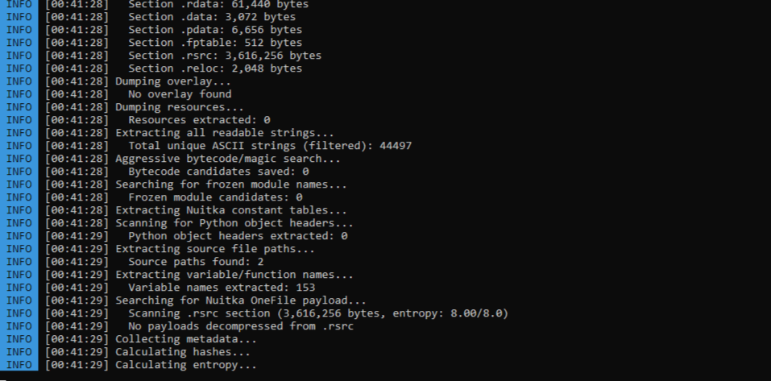
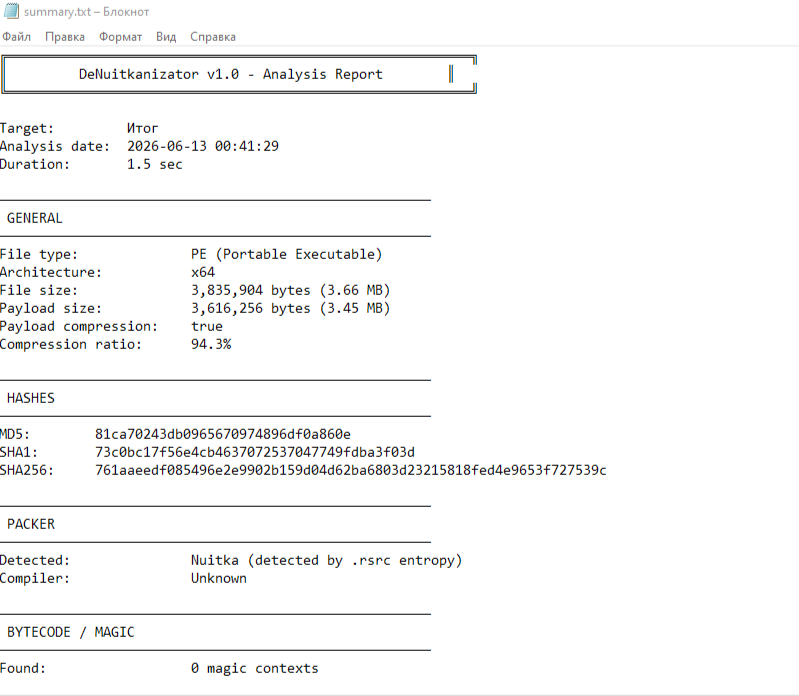

<p align="center">
  
</p>

# 🔬 DeNuitkanizator


Утилита для **анализа** .exe‑файлов, собранных через **Nuitka** (а также **PyInstaller** и другие упаковщики) и других exe-файлов не на Python. Извлекает метаданные, строки, модули, информацию о PE‑структуре и другую полезную информацию.

> **Важно:** это не декомпилятор. Nuitka компилирует Python в C, а затем в машинный код — полная обратная декомпиляция **невозможна**.
---
## Перед использованием программы обязательно ознакомьтесь с [EULA.md - лицензионное соглашение](https://github.com/2M12/DeNuitkanizator/blob/main/EULA.md)
---

>[!NOTE] 
>
>### ❗ Важные замечания
>* Результаты анализа **не гарантированы** — зависят от версии Nuitka, настроек компиляции и использования LTO.
>* Инструмент предоставляется **«как есть»** (as is).
>* **Приоритетная цель — Nuitka**, но анализатор успешно работает и с PyInstaller, cx_Freeze и другими упаковщиками.
>* Программа умеет анализировать обычный exe-файл, который написан не на Python.
>* PyInstaller выдаёт более подробную информацию, так как устроен проще и хранит больше метаданных внутри .exe.

## 🔍 Возможности

### 🕵️ Обнаружение
* Определяет сборку через **Nuitka** (по сигнатурам и энтропии `.rsrc`).
* Отличает Nuitka от PyInstaller и cx_Freeze.
* Определяет версию **Python** (3.7–3.11) по magic‑числам.

### 📥 Извлечение данных
* **Строки**: ASCII (4+/8+ символов), UTF‑16LE, UTF‑8.
* **Модули**: имена импортированных и замороженных (`frozen`) модулей Python.
* **Пути к исходникам**: отладочные пути из `.rdata`/`.data`.
* **Имена переменных и функций**: идентификаторы из секций данных.
* **Сетевые данные**: IP‑адреса, URL, email‑адреса.

### 🧩 Анализ PE‑структуры
* **Секции**: имена, размеры, энтропия, права доступа.
* **Импорты**: все DLL и функции (включая Python C API).
* **Экспорты**: экспортируемые функции.
* **Хэши**: MD5, SHA1, SHA256 файла.
* **Компилятор**: определение (MinGW GCC, MSVC, Clang/LLVM).
* **Механизмы защиты**: DEP, ASLR, цифровая подпись.

### 🗜️ Распаковка
* **Zstandard (zstd)**: основной алгоритм сжатия Nuitka OneFile.
* **Zlib**: поиск и распаковка альтернативных сжатых блоков.
* Анализ секции `.rsrc` на наличие сжатых данных.

### 💻 Дизассемблирование (при наличии Capstone)
* **Точка входа (Entry Point)**: первые 4096 байт кода.
* **Код‑секции**: первые 8192 байт каждой секции кода.

### ⚠️ Поиск подозрительных элементов
* **Anti‑debug API**: `IsDebuggerPresent`, `CheckRemoteDebuggerPresent` и др.
* **Packed sections**: аномальное соотношение raw/virtual размеров.
* **High entropy**: секции с высокой энтропией (возможное шифрование).

## 🖼️ Скриншоты

<p align="center">
  
  <br><em>Главное меню — ввод пути к .exe</em>
</p>

<p align="center">
  
  <br><em>Процесс анализа в реальном времени</em>
</p>

<p align="center">
  
  <br><em>Итоговый отчёт summary.txt</em>
</p>

---

>[!WARNING]
>
>### ⚠️ Ограничения
>
>* **Не восстанавливает исходный Python‑код.**
>* **Не декомпилирует машинный код обратно в Python.**
>* **Не гарантирует 100 % извлечение всех данных.**
>* Может пропустить часть информации при агрессивной **LTO‑оптимизации**.
>* Поддерживает анализ файлов, собранных с помощью **PyInstaller**, но это не приоритетная задача.
>* Поддерживает анализ exe-файлов, сделанных не на Python, но это не приоритетная задача.
---

## 📥 Установка

### Способ 1: Готовый .exe
Скачай `DeNuitkanizator.exe` из [Releases](https://github.com/2M12/DeNuitkanizator/releases) и запусти.

### Способ 2: Из исходников
```bash
git clone https://github.com/2M12/DeNuitkanizator.git
cd DeNuitkanizator
pip install -r requirements.txt
python DeNuitkanizator.py
```
---
## 🛠 Инструкция
1. Зайдите в программу `DeNuitkanizator.exe` или если вы скачали python-файл, то `DeNuitkanizator.py`.
2. Далее введите путь .exe файла или просто напишите сразу `python DeNuitkanizator.py "путь"`.
3. Затем начнётся анализ файла и появится результат в папке DeNuitkanizator_Output.
4. Вы можете дальше сами рассматривать файлы. В summary.txt лежит только сводка.
---
## 🔵 Требования
### Права администратора
### Если скачивается .py скрипт - установка нужных библиотек

## ☑️ Hash-суммы
```bash
MD5	2938299be1ff14fc45c89e299a05cb8f
SHA-256	bc98fddeec07df8e618f669277fc9852a0687c1cf97f1e862a842c39e9226a85
```
## 📜 Лицензия
MIT © 2026 Mikhail (2M12) / ThreatBit
